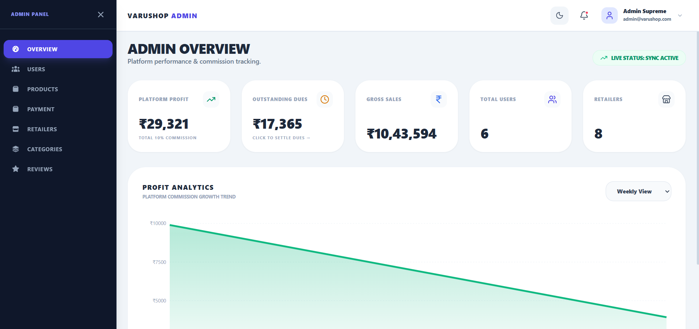
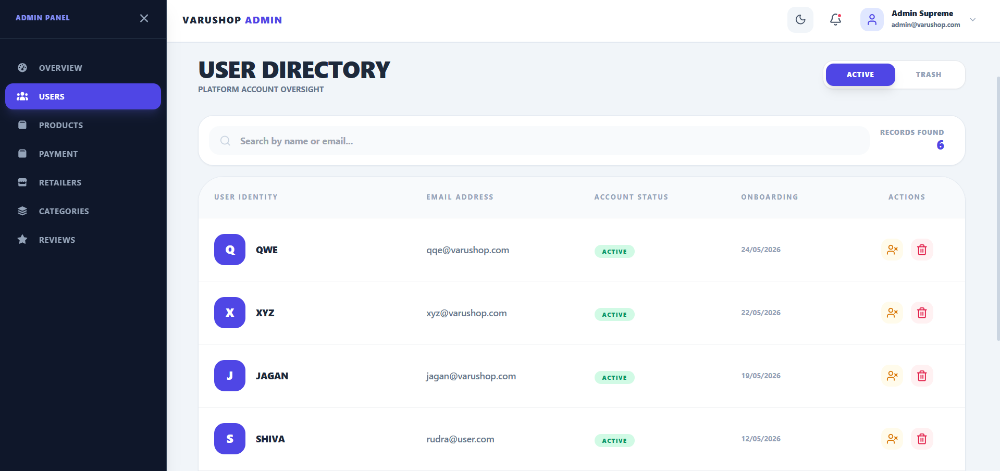
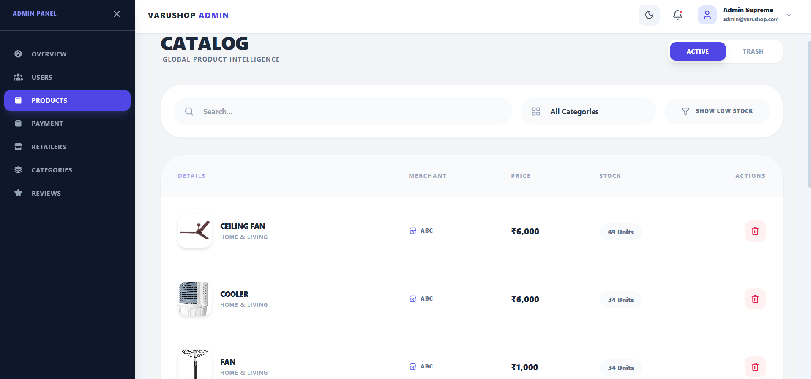
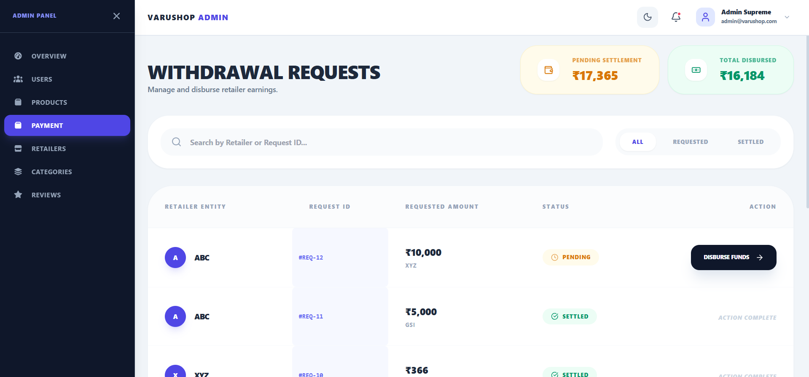

# 👑 VaruShop - Admin Dashboard

## 🚀 Overview
The **VaruShop Admin Dashboard** is a secure, centralized web application designed to oversee and manage the entire VaruShop multi-vendor ecosystem. It provides the platform owner with comprehensive tools to monitor financial health, moderate content, manage user access, and handle retailer payouts.

## ✨ Key Features

### 📊 Analytics & Overview
* **Master Dashboard:** Real-time statistics displaying total earnings, active users, and registered retailers.
* **Financial Insights:** Interactive graphs visualizing platform revenue and transaction trends over time.

### 👥 User & Retailer Management
* **Account Control:** View, block, or soft-delete user accounts to maintain a safe environment.
* **Retailer Onboarding:** Dedicated approval workflow to review and verify new vendor registrations.

### 🛍️ Catalog & Product Control
* **Category Management:** Full CRUD (Create, Read, Update, Delete) capabilities for the global platform categories.
* **Global Product Directory:** View all products uploaded by every retailer, equipped with advanced filtering and search capabilities.

### 🛡️ Moderation & Finance
* **Review Moderation:** Monitor customer feedback and delete inappropriate or spam reviews.
* **Payout Processing:** Dedicated payment portal to review and approve 90% withdrawal requests submitted by retailers.

## 🛠 Tech Stack
* **Frontend:** React, Vite, Tailwind CSS
* **Backend Integration:** Node.js / Express (Connected to centralized VaruShop API)
* **Database:** MySQL
* **Search Engine:** Meilisearch

## 🎥 Video Demonstration
Watch the full working demo of the VaruShop Admin Dashboard, showcasing user management, ecosystem analytics, and retailer payout approvals:

[](https://youtu.be/2ZMWX3ZKEUw?si=yKEZPqs8PwMzdxAT)


## 📸 Screenshots

<table>
  <tr>
    <td align="center"><a href="#"></a><br>Overview & Graphs</td>
    <td align="center"><a href="#"></a><br>User/Retailer Control</td>
  
  </tr>
  <tr>
      <td align="center"><a href="#"></a><br>Products</td>
    <td align="center"><a href="#"></a><br>Payment Approvals</td>
  </tr>
</table>

## 💻 Installation and Setup

1. **Clone the repository:**
   ```bash
   git clone this Repository


2. **Open the project & Install Dependencies:**
Navigate to the project directory in your terminal and run:
```bash
npm install

```


3. **Environment Configuration:**
* Create a `.env` file in the root directory.
* Add your centralized backend API URL (e.g., `VITE_BACKEND_URL=http://localhost:8080`).


4. **Run the Development Server:**
```bash
npm run dev

```


5. **Access the Dashboard:**
Open your browser and navigate to the local port provided by Vite (usually `http://localhost:5173`).


